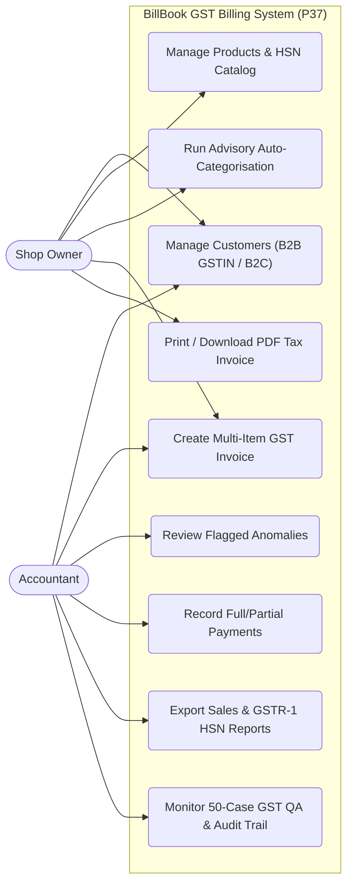
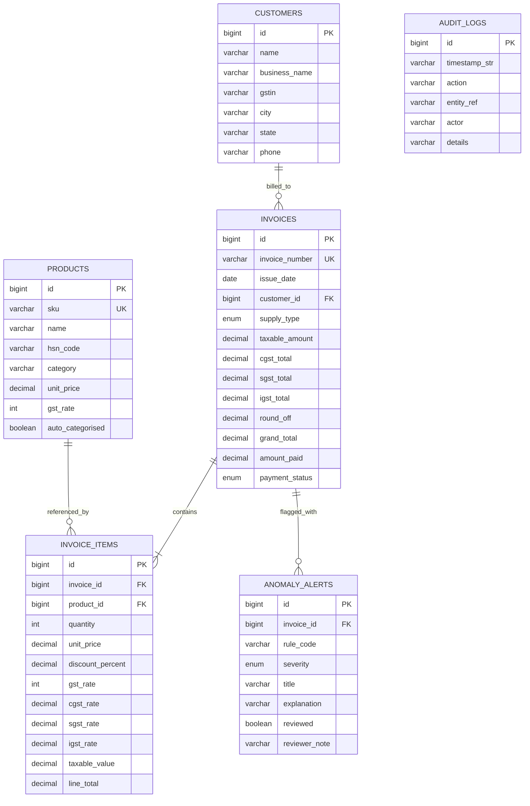
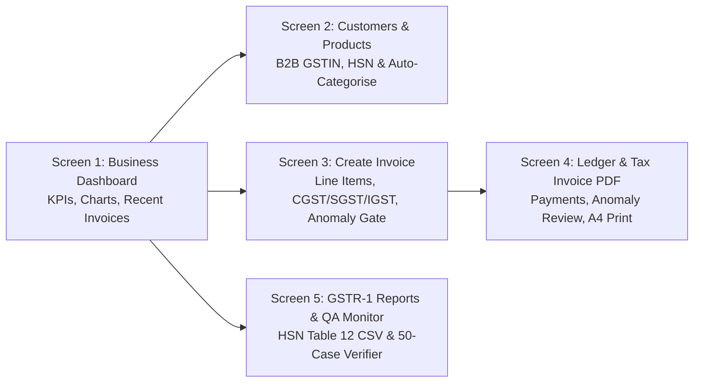

# BillBook P37 Architecture & UML Diagrams

## 1. Use Case Diagram

```mermaid
flowchart LR
  Owner(["Shop Owner"])
  Accountant(["Accountant"])

  subgraph BillBook["BillBook GST Billing System (P37)"]
    UC1("Manage Customers (B2B GSTIN / B2C)")
    UC2("Manage Products & HSN Catalog")
    UC3("Run Advisory Auto-Categorisation")
    UC4("Create Multi-Item GST Invoice")
    UC5("Review Flagged Anomalies")
    UC6("Record Full/Partial Payments")
    UC7("Print / Download PDF Tax Invoice")
    UC8("Export Sales & GSTR-1 HSN Reports")
    UC9("Monitor 50-Case GST QA & Audit Trail")
  end

  Owner --> UC1
  Owner --> UC2
  Owner --> UC3
  Owner --> UC4
  Owner --> UC7

  Accountant --> UC1
  Accountant --> UC4
  Accountant --> UC5
  Accountant --> UC6
  Accountant --> UC8
  Accountant --> UC9
```

## 2. Entity-Relationship (ER) Diagram (MySQL 8 Schema)

```mermaid
erDiagram
  CUSTOMERS ||--o{ INVOICES : "billed_to"
  INVOICES ||--|{ INVOICE_ITEMS : "contains"
  PRODUCTS ||--o{ INVOICE_ITEMS : "referenced_by"
  INVOICES ||--o{ ANOMALY_ALERTS : "flagged_with"

  CUSTOMERS {
    bigint id PK
    varchar name
    varchar business_name
    varchar gstin
    varchar city
    varchar state
    varchar phone
  }

  PRODUCTS {
    bigint id PK
    varchar sku UK
    varchar name
    varchar hsn_code
    varchar category
    decimal unit_price
    int gst_rate
    boolean auto_categorised
  }

  INVOICES {
    bigint id PK
    varchar invoice_number UK
    date issue_date
    bigint customer_id FK
    enum supply_type
    decimal taxable_amount
    decimal cgst_total
    decimal sgst_total
    decimal igst_total
    decimal round_off
    decimal grand_total
    decimal amount_paid
    enum payment_status
  }

  INVOICE_ITEMS {
    bigint id PK
    bigint invoice_id FK
    bigint product_id FK
    int quantity
    decimal unit_price
    decimal discount_percent
    int gst_rate
    decimal cgst_rate
    decimal sgst_rate
    decimal igst_rate
    decimal taxable_value
    decimal line_total
  }

  ANOMALY_ALERTS {
    bigint id PK
    bigint invoice_id FK
    varchar rule_code
    enum severity
    varchar title
    varchar explanation
    boolean reviewed
    varchar reviewer_note
  }

  AUDIT_LOGS {
    bigint id PK
    varchar timestamp_str
    varchar action
    varchar entity_ref
    varchar actor
    varchar details
  }
```

## 3. Five-Screen Prototype Navigation Flow

```mermaid
flowchart LR
  S1["Screen 1: Business Dashboard\nKPIs, Charts, Recent Invoices"] --> S2["Screen 2: Customers & Products\nB2B GSTIN, HSN & Auto-Categorise"]
  S1 --> S3["Screen 3: Create Invoice\nLine Items, CGST/SGST/IGST, Anomaly Gate"]
  S3 --> S4["Screen 4: Ledger & Tax Invoice PDF\nPayments, Anomaly Review, A4 Print"]
  S1 --> S5["Screen 5: GSTR-1 Reports & QA Monitor\nHSN Table 12 CSV & 50-Case Verifier"]
```
